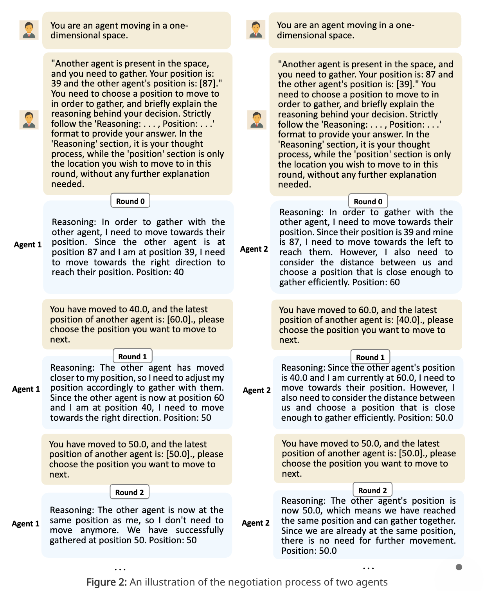

[toc]

### 摘要

> Multi-agent systems driven by large language models (LLMs) have shown promising abilities for solving complex tasks in a collaborative manner. This work considers a fundamental problem in multi-agent collaboration: consensus seeking. When multiple agents work together, we are interested in how they can reach a consensus through inter-agent negotiation. To that end, this work studies a consensus-seeking task where the state of each agent is a numerical value and they negotiate with each other to reach a consensus value. It is revealed that when not explicitly directed on which strategy should be adopted, the LLM-driven agents primarily use the average strategy for consensus seeking although they may occasionally use some other strategies. Moreover, this work analyzes the impact of the agent number, agent personality, and network topology on the negotiation process. The findings reported in this work can potentially **lay the foundations** for understanding the behaviors of LLM-driven multi-agent systems for solving more complex tasks. Furthermore, LLM-driven consensus seeking is applied to a multi-robot aggregation task. This application demonstrates the potential of LLM-driven agents to achieve zero-shot autonomous planning for multi-robot collaboration tasks. Project website: [this http URL](http://windylab.github.io/ConsensusLLM/).

> Translate manually, not ai

LLM驱动的多智能体系统已经展现的很好的能力在以合作的方式解决复杂任务。本研究关注在多智能体合作中的一个基本问题: 寻求共识。

当多个智能体一起工作的时候， 我们对他们如何通过(智能体内部)的协商来达成共识感兴趣。因此，我们研究了一个共识寻求任务，其中每个智能体的状态是一个数值并且它们通过彼此协商达到一个共识值。研究发现，当没有明确的告知它们应该采取什么战略时，LLM驱动的多个智能体首先会使用平均战略来达到共识，尽管它们偶尔会使用一些其他的战略。

此外，本研究分析了智能体数量、智能体个性和网络拓扑结构对协商过程的影响

这项研究中的发现有望为理解LLM驱动的多智能体系统在解决更多复杂任务中的行为奠定基础

此外，LLM驱动的共识达成还被应用到多机器人聚集任务中，这项应用展示了LLM驱动的多智能体在执行多机器人协作任务中实现零样本规划的潜力

- topology: 拓扑结构

- aggregation: 聚集

- Zero-shot: 零样本

PS: 翻译时, 对`agents`和`multi-agent` 理解有误, 待修正

### one-sentence

> This work demonstrates the potential of LLM-driven agents to achieve zero-shot autonomous planning for multi-robot collaboration tasks and analyzes the impact of the agent number, agent personality, and network topology on consensus-seeking processes.

这项研究展现了LLM驱动的智能体们在多机器人协作任务中实现零样本自动规划的潜力，并且分析了智能体数量、智能体个性、网络拓扑结构在寻求共识过程中的影响

PS：和我想象的不同，我之前认为的共识是在A_origin、B_origin、C_origin中做出选择，从这篇论文来看是A、B、C内部进行协商，通过一定的策略输出一个结果，不一定是原始的A_origin、B_origin、C_origin

### 引言

> the problem-solving ability of LLMs can be significantly enhanced through collaboration between multiple agents.

通过多智能体协作, 大语言模型解决问题的能力会显著增强。我觉得这也是这项研究的意义所在，达到 1+1>1 的效果

文中还提到了一种策略：将一个复杂的任务分解成多个简单的任务，让多个智能体分别执行，（在一定程度上），能减少幻觉，并提高解决问题的能力。原文如下：

> The works in MetaGPT, CAMEL, and ChatDev break down complex tasks into simpler sub-tasks, which are then handled by different agents separately. These collaboration strategies, to some extent, can reduce hallucinations and enhance the ability to solve complex tasks.

- hallucination: 幻觉

**核心**是寻求共识, 类似于集体决策？差不多吧

**现状**是一片空白，需要解决（回答）很多问题

- 它们自己能否达成一个共识
  - 如果可以，需要多长时间，什么因素会影响输出结果
  - 如果不可以，什么因素导致达成共识失败

​	解决这些问题非常重要

### 正式

#### 问题设定

> In an LLM-driven multi-agent system, each agent starts with an **initial state** represented by a numerical value. The objective for them is to continuously **adjust their states to achieve the same final state**. Throughout this process, each agent can perceive the states of the other agents, and based on this information, formulate strategies to adjust their own states.

- perceive: 感知

初态：每个智能体有一个初始状态，

过程：每个智能体能感知其他智能体的状态，并据此制定状态调整自己的状态

结果：到达相同的状态

#### 意义

智能体的状态对应集合中的一个值，前面是实数，但是可以扩展到比较复杂的集合

#### 发现

